# Sanitify Backend Control Flow Diagram

## Mermaid Diagram Code

```mermaid
graph TD
    Request((("HTTP Request Entry"))) --> Authentication{{"JWT Authentication"}}
    Request --> Authorization{{"Permission Check"}}
    
    Authentication -->|"Token Valid"| Authorization
    Authentication -->|"Token Invalid"| ErrorHandler{{"Error Handling"}}
    
    Authorization -->|"Auth Requests"| AuthAPI[["Authentication APIs"]]
    Authorization -->|"Project Requests"| ProjectAPI[["Project Management APIs"]]
    Authorization -->|"File Requests"| FileAPI[["File Management APIs"]]
    Authorization -->|"Data Requests"| DataAPI[["Data Processing APIs"]]
    Authorization -->|"Viz Requests"| VizAPI[["Visualization APIs"]]
    Authorization -->|"Share Requests"| ShareAPI[["Sharing APIs"]]
    Authorization -->|"Cloud Requests"| CloudAPI[["Cloud Integration APIs"]]
    Authorization -->|"Log Requests"| LogAPI[["Logging APIs"]]
    
    DataAPI -->|"Initialize Session"| SparkSession{{"Spark Session Management"}}
    
    SparkSession -->|"Cleaning Requests"| DataCleaning{{"Data Cleaning Engine"}}
    SparkSession -->|"Melting Requests"| DataMelting{{"Data Melting Engine"}}
    SparkSession -->|"Mapping Requests"| DataMapping{{"Data Mapping Engine"}}
    SparkSession -->|"Script Execution"| CustomScript{{"Custom Script Engine"}}
    SparkSession -->|"Pivot Generation"| PivotTable{{"Pivot Table Generator"}}
    
    VizAPI -->|"Chart Generation"| ChartGenerator{{"Chart Generation Engine"}}
    VizAPI -->|"EDA Analysis"| EDAAnalysis{{"EDA Analysis Engine"}}
    
    ChartGenerator -->|"Interactive Charts"| PlotlyEngine{{"Plotly Visualization"}}
    EDAAnalysis -->|"Statistical Plots"| PlotlyEngine
    PlotlyEngine -->|"Export Requests"| ExportEngine{{"Export Generation"}}
    
    AuthAPI -->|"User Operations"| Models{{"Django Models"}}
    ProjectAPI -->|"Project Operations"| Models
    FileAPI -->|"File Operations"| Models
    
    Models -->|"CRUD Operations"| Database{{"SQLite/PostgreSQL"}}
    Database -->|"Data Serialization"| Serializers{{"Data Serialization"}}
    
    FileAPI -->|"File Storage"| FileSystem{{"File Storage"}}
    FileSystem -->|"Media Files"| MediaStorage{{"Media Files"}}
    SparkSession -->|"Temp Files"| SparkTemp{{"Spark Temporary Files"}}
    
    CloudAPI -->|"OAuth Auth"| OAuth{{"OAuth Authentication"}}
    OAuth -->|"Google Integration"| GoogleSheets{{"Google Sheets API"}}
    OAuth -->|"Microsoft Integration"| OneDrive{{"OneDrive API"}}
    
    AuthAPI -->|"Auth Response"| Response{{"HTTP Response"}}
    ProjectAPI -->|"Project Response"| Response
    FileAPI -->|"File Response"| Response
    DataCleaning -->|"Cleaning Response"| Response
    DataMelting -->|"Melting Response"| Response
    DataMapping -->|"Mapping Response"| Response
    CustomScript -->|"Script Response"| Response
    PivotTable -->|"Pivot Response"| Response
    ChartGenerator -->|"Chart Response"| Response
    EDAAnalysis -->|"EDA Response"| Response
    ExportEngine -->|"Export Response"| Response
    ShareAPI -->|"Sharing Response"| Response
    CloudAPI -->|"Cloud Response"| Response
    LogAPI -->|"Log Response"| Response
    
    Authentication -->|"Auth Failed"| ErrorHandler
    Authorization -->|"Permission Denied"| ErrorHandler
    DataCleaning -->|"Processing Error"| ErrorHandler
    DataMelting -->|"Processing Error"| ErrorHandler
    DataMapping -->|"Processing Error"| ErrorHandler
    CustomScript -->|"Script Error"| ErrorHandler
    ChartGenerator -->|"Chart Error"| ErrorHandler
    EDAAnalysis -->|"Analysis Error"| ErrorHandler
    Database -->|"DB Error"| ErrorHandler
    FileSystem -->|"File Error"| ErrorHandler
    GoogleSheets -->|"Google API Error"| ErrorHandler
    OneDrive -->|"OneDrive Error"| ErrorHandler
    
    Request -->|"Log Request"| Logging{{"API Logging"}}
    Response -->|"Log Response"| Logging
    ErrorHandler -->|"Log Error"| Logging
    
    classDef entryPoint fill:#e1f5fe,stroke:#01579b,stroke-width:3px
    classDef authNode fill:#fff3e0,stroke:#e65100,stroke-width:2px
    classDef apiNode fill:#f3e5f5,stroke:#4a148c,stroke-width:2px
    classDef processingNode fill:#fff8e1,stroke:#ff6f00,stroke-width:2px
    classDef vizNode fill:#fce4ec,stroke:#880e4f,stroke-width:2px
    classDef dataNode fill:#e8f5e8,stroke:#1b5e20,stroke-width:2px
    classDef storageNode fill:#f1f8e9,stroke:#33691e,stroke-width:2px
    classDef cloudNode fill:#e0f2f1,stroke:#004d40,stroke-width:2px
    classDef responseNode fill:#fafafa,stroke:#424242,stroke-width:2px
    
    class Request entryPoint
    class Authentication,Authorization authNode
    class AuthAPI,ProjectAPI,FileAPI,DataAPI,VizAPI,ShareAPI,CloudAPI,LogAPI apiNode
    class SparkSession,DataCleaning,DataMelting,DataMapping,CustomScript,PivotTable processingNode
    class ChartGenerator,EDAAnalysis,PlotlyEngine,ExportEngine vizNode
    class Models,Database,Serializers dataNode
    class FileSystem,MediaStorage,SparkTemp storageNode
    class OAuth,GoogleSheets,OneDrive cloudNode
    class Response,ErrorHandler,Logging responseNode
```



## Backend Control Flow Description

### 1. Request Entry Points
- **Request**: HTTP request entry point with CORS handling
- **Authentication**: JWT token validation and user verification
- **Authorization**: Permission-based access control

### 2. API Endpoint Routing

#### Authentication Flow
```
Request → Authentication → Authorization → AuthAPI → Response
```
- JWT token validation at entry point
- User permission verification
- Authentication API endpoints (login, signup, OTP)

#### Project Management Flow
```
Request → Authentication → Authorization → ProjectAPI → Models → Database → Response
```
- Project creation, retrieval, and deletion
- File organization within projects
- User-specific project access

#### File Management Flow
```
Request → Authentication → Authorization → FileAPI → FileSystem → Response
```
- File upload and storage
- File type validation
- Media file organization

### 3. Data Processing Flow

#### Spark Session Management
```
DataAPI → SparkSession → Processing Engine → Response
```
- Apache Spark session initialization
- Distributed data processing
- Session lifecycle management

#### Data Transformation Engines
```
SparkSession → DataCleaning → Response
SparkSession → DataMelting → Response
SparkSession → DataMapping → Response
SparkSession → CustomScript → Response
SparkSession → PivotTable → Response
```
- Multiple specialized processing engines
- Spark-based distributed processing
- Custom Python script execution

### 4. Visualization Flow

#### Chart Generation
```
VizAPI → ChartGenerator → PlotlyEngine → ExportEngine → Response
```
- Interactive chart creation using Plotly
- Multiple chart types and configurations
- Export in various formats

#### EDA Analysis
```
VizAPI → EDAAnalysis → PlotlyEngine → ExportEngine → Response
```
- Exploratory data analysis
- Statistical plot generation
- Data profiling and insights

### 5. Database Operations Flow

#### Data Persistence
```
API → Models → Database → Serializers → Response
```
- Django ORM for database operations
- Model-based data validation
- JSON serialization for API responses

#### Model Relationships
- **User**: Core user entity with authentication
- **Projects**: User-specific project organization
- **Files**: Project file management
- **Plots**: Visualization storage
- **Scripts**: Custom script storage
- **Shares**: Project sharing and collaboration

### 6. File System Operations

#### File Storage
```
FileAPI → FileSystem → MediaStorage → Response
```
- Organized file storage structure
- Media file management
- File access control

#### Spark Temporary Files
```
SparkSession → SparkTemp → Processing
```
- Temporary file management for Spark
- Session-specific file isolation
- Automatic cleanup

### 7. Cloud Integration Flow

#### OAuth Authentication
```
CloudAPI → OAuth → Cloud Service → Response
```
- OAuth-based authentication
- Token management and refresh
- Secure API communication

#### Cloud Services
- **Google Sheets**: Spreadsheet integration
- **OneDrive**: Microsoft cloud integration
- **Real-time Sync**: Bidirectional data synchronization

### 8. Error Handling and Logging

#### Error Handling Flow
```
Any Processing Step → ErrorHandler → Logging → Error Response
```
- Comprehensive error handling at all levels
- Detailed error logging for debugging
- User-friendly error messages

#### Logging System
```
Request → Logging
Response → Logging
ErrorHandler → Logging
```
- Request/response logging
- User action tracking
- Performance monitoring
- Audit trail maintenance

### 9. Response Generation Flow

#### Success Response
```
Processing Complete → Serializers → Response
```
- JSON-formatted responses
- Consistent response structure
- Data serialization

#### Error Response
```
Error Detected → ErrorHandler → Error Response
```
- Standardized error format
- HTTP status code mapping
- Error message localization

### 10. Performance Optimization

#### Caching Strategy
- Database query caching
- API response caching
- Session-based caching
- Redis integration (production)

#### Async Processing
- Background task processing
- File upload handling
- Large dataset processing
- Email notification sending

### 11. Security Considerations

#### Authentication Security
- JWT token-based authentication
- Token expiration and refresh
- Secure password hashing
- OTP verification system

#### Data Security
- Input validation and sanitization
- SQL injection prevention
- File upload security
- API rate limiting

#### Access Control
- Permission-based access
- Project-level security
- File-level access control
- Sharing permission management

### 12. Monitoring and Observability

#### API Monitoring
- Request/response time tracking
- Error rate monitoring
- Endpoint usage statistics
- Performance metrics

#### Logging and Debugging
- Structured logging
- Error tracking
- User action auditing
- Debug information capture

## Key Decision Points

1. **Authentication Status**: Determines API access and user permissions
2. **Request Type**: Routes to appropriate API endpoint
3. **Data Processing Type**: Determines which processing engine to use
4. **Visualization Type**: Routes to chart or EDA analysis
5. **Cloud Service**: Determines OAuth flow and service integration
6. **Error Type**: Determines error handling strategy
7. **Response Format**: Determines serialization and output format

## Terminal Points

1. **Response**: Successful API response
2. **Error Response**: Error handling completion
3. **Logging**: Audit trail completion
4. **File Storage**: File operation completion
5. **Cloud Sync**: Cloud integration completion

## Performance Considerations

1. **Spark Session Reuse**: Efficient session management
2. **Database Connection Pooling**: Optimized database access
3. **File Caching**: Reduced file I/O operations
4. **Async Processing**: Non-blocking operations
5. **Memory Management**: Efficient data processing
6. **Concurrent Processing**: Parallel operation handling

This backend control flow ensures robust, scalable, and secure data processing while maintaining high performance and comprehensive monitoring capabilities.
